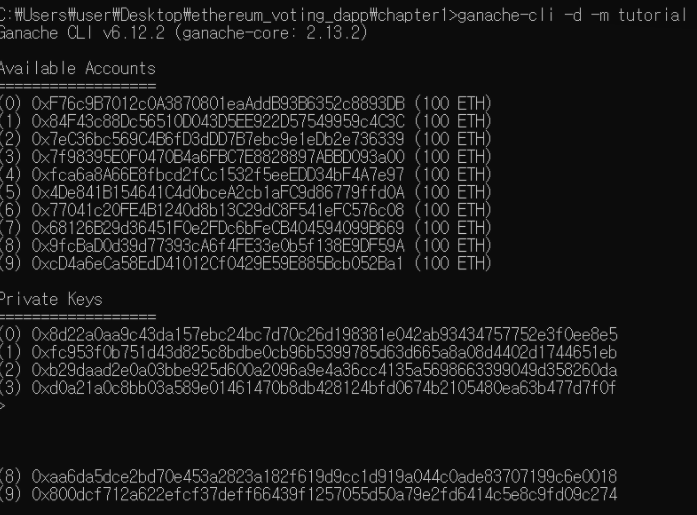

# 2022.09.13(화)

# [Python][프로그래머스 Lv.2] 괄호 변환

### 나의 풀이
```Python
def correct(s):
    a = 0
    b = 0
    arr = list(s)
    for i in arr:
        if i =='(' and a >= b:
            a += 1
        elif i == ')' and a >= b:
            b += 1
        else:
            return False
    if a == b:
        return True
    else:
        return False

def solution(p):
    answer = ''
    a = 0
    u = ''
    v = ''
    tmp=''
    if correct(p) or len(p)==0:
        return p
    arr = list(p)
    for i in range(len(arr)):
        if arr[i] == '(':
            a += 1
        else: 
            a -= 1
        if a == 0:
            u = p[0:i+1]
            v = p[i+1:]
            break
    if correct(u):
        return u + solution(v)
    else:
        tmp += '('
        tmp += solution(v)
        tmp += ')'
        for c in u[1:len(u)-1]:
            if c == '(':
                tmp += ')'
            else:
                tmp += '('
    return answer + tmp
```
// correct(): 올바른 괄호 문자열인지 확인    
correct()는 옛날에 풀었던 올바른 괄호 문제에서 그대로 가져온 코드이다.

문제가 지시하는 순서대로 코드를 작성했다.

 

1. 주어진 문자열이 올바른 괄호 문자열이거나 빈 문자열이면 그대로 반환(return)
2. 주어진 문자열을 균형잡힌 문자열 u와 나머지 문자열 v로 나누어 반환
3. u가 올바른 문자열이면, 1로 돌아가 v에 대해 수행한 후 u에 그 결과를 더해줌(return)
4. u가 올바른 문자열이 아니면, 1로 돌아가 v에 대해 수행한 결과를 '('와 ')' 사이에 넣고
첫 번째 문자, 마지막 문자를 제거한 u에 대해 괄호 방향을 반대로 바꿔줌
5. 4에서 수행한 결과를 return


예를 들어,     
"()))((()"의 경우 위의 순서대로 수행하면 다음과 같다.    
u = "()"     
v = "))((()"      
answer = u + solution("))((()")      

u = "))(("      
v = "()      
answer = "(" + solution("()") + ")" + "()"       
// 마지막에 더해지는 괄호 문자열: 첫 번째 문자, 마지막 문자를 제거한 u에 대해 괄호 방향을 반대로 바꿔준 것      

answer = "()"      

여기서 return되면 answer = "()" + "(" + "()" + ")" + "()" 이다.     
따라서, 결과는 "()(())()"가 나온다.     
 

### 다른 사람의 풀이
```Python
def solution(p):
    if p=='': return p
    r=True; c=0
    for i in range(len(p)):
        if p[i]=='(': c-=1
        else: c+=1
        if c>0: r=False
        if c==0:
            if r:
                return p[:i+1]+solution(p[i+1:])
            else:
                return '('+solution(p[i+1:])+')'+''.join(list(map(lambda x:'(' if x==')' else ')',p[1:i]) ))
```
lambda를 써보는 연습을 해봐야겠다..

# 2022.09.13(화)
## 이더리움 & 솔리디티 기반의 투표 dApp 구현하기

1. 솔리디티를 사용하여 스마트 컨트랙트 작성
    
    솔리디티: 스마트 컨트랙트를 작성하기 위한 언어
    
2. 스마트 컨트랙트를 컴파일하고 블록체인에 배포
3. node.js 콘솔에서 테스트하고 웹페이지와 상호작용

### 목표

탈중앙화 서버이므로 애플리케이션을 강제 종료하는 게 불가능함

후보자 정보를 초기화하고, 투표하면 투표 정보가 블록체인에 저장됨

voting이라는 컨트랙트를 작성

### 투표 dAPP 구조


가나슈(개발 목적으로만 쓰이는 가짜 블록체인) 설치 필요

스마트 컨트랙트 작성, 블록체인에 배포

커맨드라인을 통해 상호작용, 웹페이지를 통해 상호작용

블록체인과 상호작용하려면 RPC 필요

Web3JS: RPC 호출을 추출하는 라이브러리, 자바스크립트로 블록체인과 상호작용하게 해줌

### 환경설정

npm 패키지 설치

1. 솔리디티 컴파일러
2. web3.js
3. 가나슈

```python
// ganache-cli 설치
$ npm install -g ganache-cli

// node에 접속
$ node

> Web3 = require('web3')
> web3 = new Web3(new Web3.providers.HttpProvider("http://localhost:8545"))
// 생성된 10개의 계정을 확인
> web3.eth.getAccounts (console.log)

// 생성된 계정을 확인하는 방법2
$ ganache-cli -d -m tutorial
```



```python
// 계정에 100이더가 있는지 확인
> web3.eth.getBalance('0xf76c9b7012c0a3870801eaaddb93b6352c8893db')
BigNumber { s: 1, e: 20, c: [ 1000000 ] }

> web3.eth.getBalance('0xf76c9b7012c0a3870801eaaddb93b6352c8893db').toNumber()
100000000000000000000

//웨이 단위 -> 이더 단위로 변환
> web3.fromWei('100000000000000000000', 'ether')
'100'
```

### 컨트랙트 작성


```Solidity
pragma solidity ^0.4.23;

contract Voting {
    // 후보자를 초기화할 생성자
    // 후보자에게 투표하는 기능
    // 각 후보자가 얻은 표 계산

    bytes32[] public candidateList;

    // 각 후보자의 득표 수 추적하기 위해 mapping 사용
    mapping (bytes32 => uint8) public votesReceived;

    //constructor 생성자, byte32 자료형(배열을 지원하지 않음)
    constructor(bytes32[] candidateNames) public { 
        candidateList = candidateNames;
    }
    function voteForCandidate(bytes32 candidate) public {
        // 유효하지 않으면 다음 행으로 넘어가지 않음
        require(validCandidate(candidate));
        votesReceived[candidate] += 1;
    }

    // view는 읽기 전용 함수를 나타냄
    function totalVotesFor(bytes32 candidate) view public returns(uint8) {
        require(validCandidate(candidate));
        return votesReceived[candidate];
    }

    // 유효한 후보인지 체크
    function validCandidate(byte32 candidate) view public returns(bool) {
        for (uint i=0; i<candidateList.length; i++) {
            if (candidateList[i] == candidate) {
                return true;
            }
        }
        return false;
    }
}
```