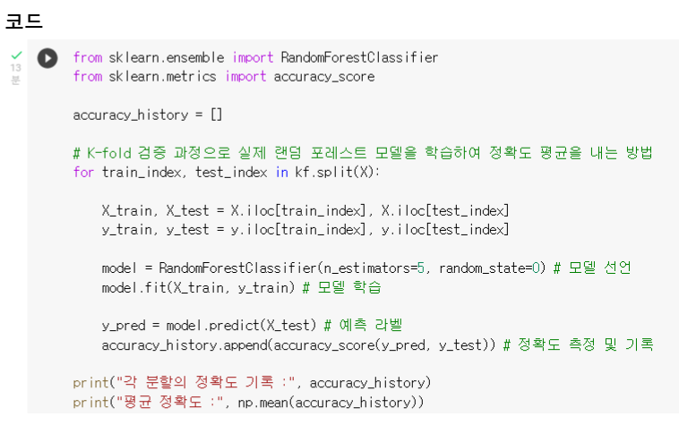

# 2022.10.11(화)

## [Python][백준 4673번] 셀프 넘버

### 틀린 풀이
```Python
# 시간초과
lst=[]
for j in range(1, 10001):
    n = j
    while n <= 10000:
        lst.append(n+sum(list(map(int, str(n)))))
        n=n+sum(list(map(int, str(n))))
        
for i in range(1, 10001):
    if i not in lst:
        print(i)
```

### 맞은 풀이
```Python
lst = []
def solution(n):
    return n + sum(list(map(int, str(n))))

for i in range(1, 10001):
    if solution(i) <= 10000:
        lst.append(solution(i))

for i in range(1, 10001):
    if i not in lst:
        print(i)
```
while 문을 없애서 시간복잡도를 줄였다.

# 2022.10.12(수)

## [Python][백준 1065번] 한수

### 나의 풀이
```Python
def solution(n):
    lst = []
    count = 0
    if n < 100:
        count = n 
    else:
        count += 99
        for i in range(100, n+1):
            lst = list(map(int, str(i)))
            if ((lst[2]-lst[1]) == (lst[1]-lst[0])):
                count += 1
    return count
```
입력 안 받아서 틀렸다.

```Python
def solution(n):
    lst = []
    count = 0
    if n < 100:
        count = n 
    else:
        count += 99
        for i in range(100, n+1):
            lst = list(map(int, str(i)))
            if ((lst[0]-lst[1]) == lst[1]-lst[2]):
                count += 1
    return count

n = int(input())
print(solution(n))
```

# 2022.10.13(목)

## [Python][백준 4344번] 평균은 넘겠지
### 나의 풀이
```Python
import sys
n = int(input())
for i in range(n):
    lst = list(map(int, sys.stdin.readline().split()))
    count = 0
    for j in range(1, lst[0]+1):
        if lst[j]>((sum(lst)-lst[0])/lst[0]):
            count += 1
    print("{:.3f}".format(count/lst[0]*100), '%', sep='')
```
format 어떻게 쓰는지 잘 모르겠다..
더 공부해야할 것 같다.

# 2022.10.14(금)

## k-fold-cross-validation
머신러닝을 돌리기 전에 train set과 test set을 나누어 머신을 훈련한다. 그러나 이 훈련 때 학습 데이터에 과도하게 초점을 맞춰 머신이 훈련될 수 있다. 이 같은 경우에는 훈련 시에는 점수가 잘 나오지만 실제 테스트를 할 때는 점수가 잘 나오지 않는다. 이를 과적합(overfitting)이라고 한다.

따라서 훈련 시에 이 같은 과적합을 막기 위해 교차검증을 한다. 교차 검증이란 훈련 데이터 셋을 바꿔가면서 훈련하여 나온 평균을 정확도로 보는 방법을 뜻한다.


k-fold-cross-validation는 학습 셋과 검증 셋을 나눠 반복해서 검증하여 k값만큼의 fold 셋에 k번의 학습과 검증을 하는 방식이다. 결국 k번 평가를 하게 된다.



1. 데이터를 K 등분한다. (이미지의 경우 K=5)

2. 1/5 를 검증데이터로, 나머지 4/5 를 학습 데이터로 

3. 1/5 를 검증데이터를 바꾸며 성능 평가 

-> 총 5개의 성능 결과가 나올 것이다. 이 5개의 평균을 해당 학습 모델의 성능이라 한다. 